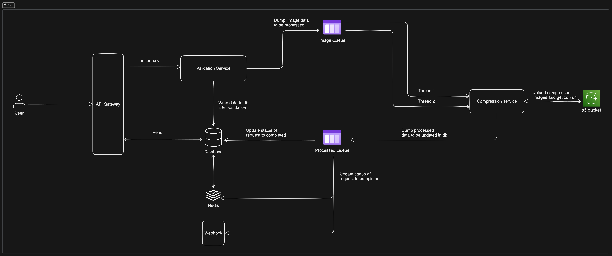
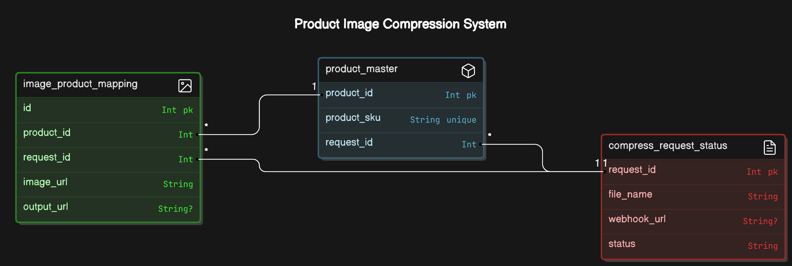
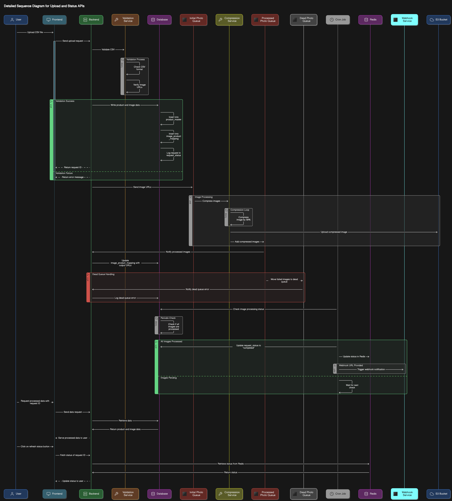

# **Acrchitecture**

## High Level Diagram

**1. User Request**

* A user submits an image to the API gateway.

**2. Validation**

* The API gateway forwards the request to the validation service.
* The validation service checks the image for validity, ensuring it meets specific criteria (e.g., format, image validation etc).
* If the image is valid, it's added to the image queue.

**3. Compression**

* The compression service processes images from the image queue.
* The service applies compression algorithms to reduce the image's file size.
* Once compressed, the processed image is added to the processed queue.

**4. Database Update**

* The system updates the database to record the request's completion status and any relevant data, such as the original and compressed image sizes.

**5. Webhook Notification**

* If configured, a webhook is triggered to notify external systems about the processed image.
* This notification can be used to update other applications or services with the processed image information.

## ERD Diagram

## Detailed Sequence Diagram

